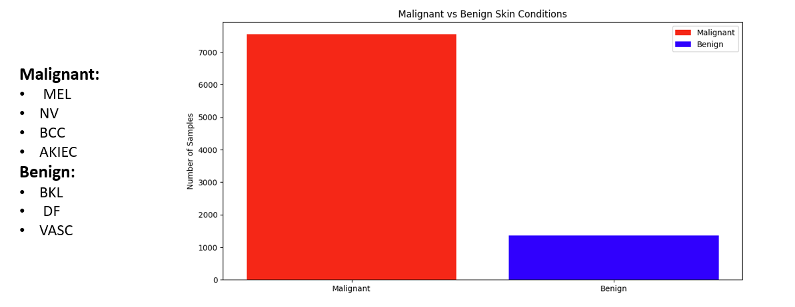
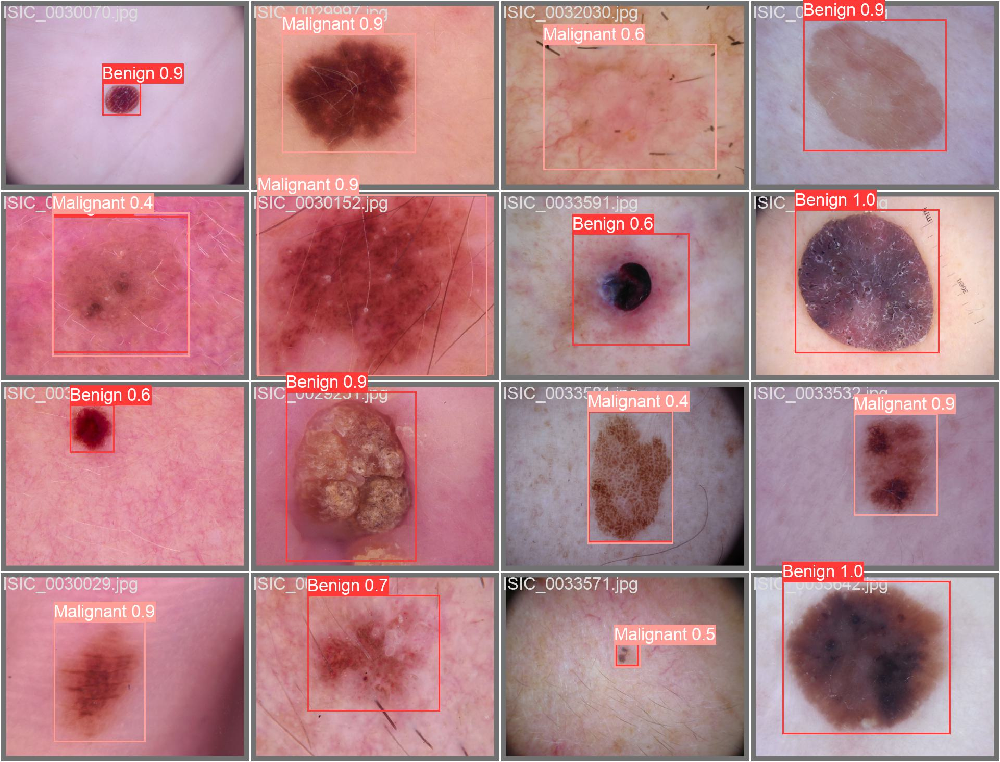

# Skin Cancer Detection with YOLOv5 and YOLOv8

## Objective
Detect skin cancer by converting HAM10000 dataset segmentation masks into bounding boxes and simplifying multi-class skin lesion types into binary labels. The models used are YOLOv5 and YOLOv8.

## Dataset: HAM10000
The Lesions Segmentation dataset includes skin lesion images with segmentation masks and multi-class labels. This project preprocesses the dataset for binary classification and object detection.

**Source:** HAM10000 Dataset

## Data Preprocessing

### Convert Segmentation Masks to Bounding Boxes
Generate bounding boxes around lesions from segmentation masks. Each mask is processed to find the smallest rectangle containing the lesion.

### Binary Label Transformation
Simplify multiple classes into binary labels: 1 for malignant (cancerous) lesions, 0 for benign (non-cancerous) lesions.

### Data Balancing (Down Sampling)
Downsample the majority class (malignant) to address class imbalance.

### Dataset Split
Split into training, validation, and test sets for fair model evaluation.

## Reason for Object Detection
Object detection identifies background regions without lesions, crucial for real-world applications where images may have non-lesion areas. This is more practical compared to classification and segmentation models that do not separate background regions.

## Model Training: YOLOv5 and YOLOv8

### YOLOv5
Known for speed and accuracy. Achieved:
- mAP@50: 87%
- mAP@50-95: 69%

### YOLOv8
YOLO version 8 - improved performance. Trained on the same dataset to compare with YOLOv5. Achieved:
- mAP@50: 90%
- mAP@50-95: 74%

## Training Pipeline

### Data Augmentation
Techniques like rotation, scaling, and flipping increase training data diversity.

### Model Configuration
Tune hyperparameters (learning rate, batch size, epochs) for optimal performance. Adjust specific augmentations and configurations for skin lesion images.

### Evaluation Metrics
- mAP@50: Average precision at 50% IoU threshold.
- mAP@50-95: Average precision across multiple IoU thresholds for comprehensive evaluation.

## Results
Best Performance - YOLOv8:
- mAP@50: 90%
- mAP@50-95: 74%

